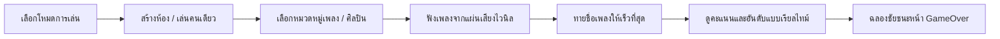

# 🎵 SongGuessr (เกมทายเพลงออนไลน์สุดมันส์)

<p align="center">
  
</p>

<p align="center">
  <strong>เกมทายเพลงทดสอบความไวทางดนตรี เล่นคนเดียวสะสมสถิติ หรือเปิดห้องดวลกับเพื่อนแบบ Real-time!</strong><br>
  ดึงเพลงฮิตแบบ Live Search จาก iTunes API ครบทั้งเพลงไทย สากล K-Pop และ Anime/J-Pop
</p>

<p align="center">
  
  
  
  
  
  
</p>

---

## 📖 สารบัญ
- [✨ ภาพรวมของเกม (Overview)](#-ภาพรวมของเกม-overview)
- [🚀 ฟีเจอร์เด่น (Key Features)](#-ฟีเจอร์เด่น-key-features)
- [🎮 โหมดการเล่น (Game Modes)](#-โหมดการเล่น-game-modes)
- [🎯 รูปแบบการตอบเพลง (Answer Styles)](#-รูปแบบการตอบเพลง-answer-styles)
- [🧠 ระบบตรวจคำตอบอัจฉริยะ (Smart Song Matching)](#-ระบบตรวจคำตอบอัจฉริยะ-smart-song-matching)
- [⏱️ ระบบคิดคะแนนตามความไว (Authoritative Scoring)](#️-ระบบคิดคะแนนตามความไว-authoritative-scoring)
- [🕹️ วิธีการเล่น (How to Play)](#️-วิธีการเล่น-how-to-play)
- [🛠️ เทคโนโลยีที่ใช้พัฒนา (Tech Stack)](#️-เทคโนโลยีที่ใช้พัฒนา-tech-stack)
- [💻 การติดตั้งและรันในเครื่อง (Getting Started)](#-การติดตั้งและรันในเครื่อง-getting-started)
- [📁 โครงสร้างโปรเจกต์ (Project Structure)](#-โครงสร้างโปรเจกต์-project-structure)

---

## ✨ ภาพรวมของเกม (Overview)

**SongGuessr** คือเว็บเกมทายชื่อเพลงที่ออกแบบมาเพื่อคนรักเสียงเพลงทุกเพศทุกวัย ตัวเกมจะเล่นท่อนพรีวิวเพลงแบบสุ่มความยาว 30 วินาทีผ่านเครื่องเล่นแผ่นเสียงไวนิลจำลอง ผู้เล่นต้องฟังแล้วทายให้ถูกต้องและรวดเร็วที่สุด ยิ่งตอบไวยิ่งได้คะแนนเยอะ มีระบบห้องเล่นหลายคนแบบ **Serverless Real-time Multiplayer** ที่แชร์เพียงรหัสห้อง 4 หลักหรือส่งลิงก์ให้เพื่อน ก็สามารถเข้ามาร่วมสนุกและประชันคะแนนกันได้ทันทีแบบไม่ต้องสมัครสมาชิก

---

## 🚀 ฟีเจอร์เด่น (Key Features)

### 1. 👥 ระบบห้องเล่นหลายคนแบบเรียลไทม์ (Real-time Multiplayer)
- สร้างห้องง่ายๆ ด้วย **รหัสห้อง 4 หลัก** (เช่น `ET6V`) หรือส่งลิงก์เชิญเพื่อน
- รองรับผู้เล่นพร้อมกันในห้องได้หลายคน เชื่อมต่อผ่าน **MQTT over WebSocket** แบบ P2P-inspired Serverless
- ระบบ **Host Synchronization** ควบคุมรอบเพลง ตัวจับเวลา และการคิดคะแนนจากฝั่งหัวหน้าห้อง ป้องกันคะแนนเพี้ยนหรือเน็ตเหลื่อมล้ำ
- หน้าจอเกมแสดง **Sidebar รายชื่อผู้เล่นแบบสด (Live Column)** เห็นชัดเจนว่าใครกำลังฟัง หรือใครกดส่งคำตอบแล้ว พร้อมเวลาที่ใช้

### 2. ⚔️ โหมดดราฟต์ดวลเพลง 1v1 (SongDraft Duel: Pick & Ban)
- ท้าดวลตัวต่อตัวสไตล์ E-Sports สลับกันเลือก (Pick) และแบน (Ban) ศิลปินแบบสดๆ
- ฝ่ายละเลือก 5 ศิลปิน และแบนฝ่ายตรงข้าม 2 ศิลปิน จากนั้นระบบจะสุ่มเพลงจากศิลปินที่ถูกเลือกมาแข่งกัน

### 3. 🎶 คลังเพลงมหาศาล สดใหม่เสมอ (Dynamic Live iTunes Integration)
- เชื่อมต่อกับ **Apple iTunes Search API** สตรีมเสียงพรีวิวคุณภาพสูงถูกลิขสิทธิ์
- ครอบคลุมกว่า **70+ ศิลปินตัวท็อป** และแนวเพลงหลากหลาย:
  - 🇹🇭 **เพลงไทย:** Bodyslam, Potato, Three Man Down, Tilly Birds, Safeplanet, Jeff Satur, NONT TANONT, 4EVE, PROXIE, มนต์แคน แก่นคูน, คาราบาว, ลำไย ไหทองคำ
  - 🌐 **เพลงสากล:** Taylor Swift, Bruno Mars, The Weeknd, Billie Eilish, Coldplay, Maroon 5, Ed Sheeran, Ariana Grande
  - 🇰🇷 **K-Pop:** BTS, BLACKPINK, NewJeans, TWICE, Stray Kids, aespa, SEVENTEEN, IVE, LE SSERAFIM
  - 🇯🇵 **Anime & J-Pop:** YOASOBI, LiSA, Official HIGE DANDism, Ado, Kenshi Yonezu, Mrs. GREEN APPLE, ONE OK ROCK
  - 🎲 **สุ่มรวมมิตรทุกแนวเพลง (Random Mega Mix):** สุ่มหยิบเพลงจากทุกแนวมาไว้ในเกมเดียว
- **ระบบคัดกรองศิลปิน (Custom Artist Studio):** สามารถติ๊กเลือกศิลปินเฉพาะคนที่อยากทายได้เองอย่างอิสระ

### 4. 💽 แผ่นเสียงไวนิล & Audio Visualizer
- เครื่องเล่นแผ่นเสียง Vinyl Record Player แอนิเมชันหมุนตามจังหวะเพลง
- แสดงกราฟิกคลื่นเสียงแบบเรียลไทม์ (Audio Visualizer) ผ่าน **Web Audio API**
- ซาวด์เอฟเฟกต์ตอบถูก ตอบผิด นับถอยหลัง และเสียงเริ่มเกมเพื่อเพิ่มความตื่นเต้น

---

## 🎮 โหมดการเล่น (Game Modes)

| โหมด | รายละเอียด |
| :--- | :--- |
| **เล่นคนเดียว (Solo Mode)** | เล่นเพลินๆ วัดความรู้ทางดนตรี ท้าทายสถิติตัวเอง สะสม Streak ตอบถูกต่อเนื่อง และบันทึกคะแนนสูงสุด |
| **ห้องหลายคน (Multiplayer Room)** | สร้างห้องชวนเพื่อน เล่นทายเพลงพร้อมกัน แข่งกันตอบไวเพื่อแย่งชิงอันดับ 1 ประจำห้อง |
| **ดวล 1v1 (SongDraft Duel)** | ประชันกลยุทธ์การ Pick & Ban ศิลปินตัวต่อตัว ชิงไหวชิงพริบว่าใครแม่นเพลงของใครมากกว่า |

---

## 🎯 รูปแบบการตอบเพลง (Answer Styles)

ผู้สร้างห้องหรือผู้เล่นสามารถเลือกรูปแบบการตอบได้ 3 แบบตามระดับความท้าทาย:

1. **🔘 4 ช้อยส์ (Multiple Choice):** รูปแบบมาตรฐาน มีตัวเลือก 4 ตัว พร้อมปุ่มตัวช่วยตัดช้อยส์ **50:50**
2. **🔤 พิมพ์ตอบเอง (Pure Text Input):** โหมดฮาร์ดคอร์ ปิดตัวช่วยดร็อปดาวน์ทั้งหมด ต้องพิมพ์ชื่อเพลงด้วยตัวเองเท่านั้น
3. **💡 พิมพ์พร้อมตัวช่วยค้นหา (Autocomplete):** เมื่อเริ่มพิมพ์ชื่อเพลง จะมีรายชื่อเพลงที่ตรงกันขึ้นมาให้เลือกกดส่งคำตอบได้สะดวก

---

## 🧠 ระบบตรวจคำตอบอัจฉริยะ (Smart Song Matching)

SongGuessr มีระบบ Normalize ข้อความและเปรียบเทียบชื่อเพลงขั้นสูง เพื่อให้การทายเพลงแฟร์และสนุกที่สุด:
- **ละเว้นวรรคตอนและเครื่องหมายพิเศษ:** ไม่สนใจตัวพิมพ์เล็ก-ใหญ่ (Case-Insensitive) หรือสัญลักษณ์แปลกๆ
- **ตัดส่วนขยายที่ไม่จำเป็นอัตโนมัติ:** ตัดคำว่า `(Cover)`, `(Acoustic Version)`, `(Feat. ...)`, `[OST]`, `【Official Audio】` ออกให้อัตโนมัติ ตอบแค่ชื่อเพลงหลักก็ถือว่าถูกต้อง
- **รองรับชื่อเพลงภาษาคาราโอเกะ (Romanized Thai):** เช่น พิมพ์ `mua kuen` ตรวจผ่านเพลง `เมื่อคืน`, `rak tid siren` ตรวจผ่านเพลง `รักติดไซเรน`
- **ระบบพจนานุกรมชื่อเพลง 2 ภาษา (Song Title Aliases):** เพลงที่มีทั้งชื่อไทยและอังกฤษ เช่น `รักติดไซเรน` <-> `My Ambulance`, `รังเกียจกันไหม` <-> `Do You Mind` สามารถพิมพ์ตอบชื่อไหนก็ถูกต้องทันที

---

## ⏱️ ระบบคิดคะแนนตามความไว (Authoritative Scoring)

ระบบคำนวณคะแนนตามเวลาที่ใช้ตอบจริงในรอบนั้นๆ (เต็ม 100 คะแนนต่อข้อ):
- **0 – 0.5 วินาที:** 100 คะแนนเต็ม (ช่วง Reaction Time ตอบทันที)
- **1 – 4 วินาที:** 94 – 99 คะแนน (ตอบไวมากหลังได้ยินอินโทร)
- **5 – 10 วินาที:** 77 – 90 คะแนน (ตอบได้ช่วงต้นเพลง)
- **11 – 16 วินาที:** 53 – 74 คะแนน (ช่วงรอเข้าท่อนฮุก)
- **17 – 23 วินาที:** 15 – 49 คะแนน (ช่วงฟังเนื้อเพลง)
- **23.5 วินาทีขึ้นไป:** 10 คะแนน (คะแนนพื้นฐานขั้นต่ำเมื่อตอบถูก)
- **ตอบผิด หรือหมดเวลา:** 0 คะแนน

> 🔒 **ระบบ Host Authoritative:** ในการเล่นหลายคน เครื่อง Host จะเป็นผู้ตรวจสอบเวลา (`timeTaken`) และคำนวณคะแนนของทุกคนด้วยสูตรเดียวกัน ทำให้คะแนนเที่ยงตรง เป็นธรรม และไม่มีปัญหาความเหลื่อมล้ำจากเวอร์ชันของเบราว์เซอร์

---

## 🕹️ วิธีการเล่น (How to Play)



1. **เข้าสู่เกม:** เลือกได้ว่าจะเล่นคนเดียว (Solo) หรือสร้างห้องเล่นหลายคน (Multiplayer)
2. **ตั้งค่าห้อง (สำหรับหัวหน้าห้อง):**
   - เลือกรอบการเล่น (5, 10, 15, 20 รอบ)
   - เลือกเวลาตอบแต่ละข้อ (ค่าเริ่มต้น 30 วินาที)
   - เลือกหมวดหมู่เพลง หรือกด **"กดสุ่มศิลปิน"** เพื่อจัดชุดเพลงแข่งขัน
3. **ฟังและทาย:** ฟังเสียงพรีวิว 30 วินาที แล้วเลือกช้อยส์หรือพิมพ์ตอบให้เร็วที่สุด
4. **ใช้ตัวช่วย (Hints):** หากนึกไม่ออก สามารถกดเปิดตัวช่วยได้ (หักคะแนนตามความยากของตัวช่วย)
   - 🎤 ใบ้ชื่อศิลปิน (-20 คะแนน)
   - ✨ ใบ้อักษรแรกของชื่อเพลง (-10 คะแนน)
   - 📄 ใบ้ความยาวและจำนวนตัวอักษร (-15 คะแนน)
   - 🌓 ตัด 2 ช้อยส์ผิด (สำหรับโหมด 4 ช้อยส์)
5. **สรุปผลคะแนน:** ดูผลสรุปประจำข้อแบบ 2 คอลัมน์ (คะแนนที่ได้ในข้อนั้น เทียบกับตารางคะแนนรวม) และสรุปโพเดียมผู้ชนะเมื่อจบเกม

---

## 🛠️ เทคโนโลยีที่ใช้พัฒนา (Tech Stack)

| ส่วนประกอบ | เทคโนโลยีที่เลือกใช้ |
| :--- | :--- |
| **Frontend Core** | [React 19](https://react.dev/) + [TypeScript](https://www.typescriptlang.org/) |
| **Build Tool & Bundler** | [Vite 6](https://vitejs.dev/) |
| **Styling & Design System** | Vanilla CSS (CSS Grid, Flexbox, Custom Design Tokens, Glassmorphism) |
| **Real-time Networking** | [MQTT.js](https://github.com/mqttjs/MQTT.js) (MQTT over WebSocket via Public HiveMQ / Eclipse Brokers) |
| **P2P Alternative** | [PeerJS](https://peerjs.com/) (WebRTC) |
| **Audio Processing** | Web Audio API (AudioContext, AnalyserNode สำหรับ Live Visualizer) |
| **Icons & Visuals** | [Lucide React](https://lucide.dev/) + [Canvas Confetti](https://github.com/catdad/canvas-confetti) |
| **Music Data API** | Apple iTunes Search & Lookup API |
| **Code Linter** | [Oxlint](https://oxc.rs/) |
| **Deployment** | [Cloudflare Pages](https://pages.cloudflare.com/) via Wrangler CLI |

---

## 💻 การติดตั้งและรันในเครื่อง (Getting Started)

### ข้อกำหนดเบื้องต้น (Prerequisites)
- [Node.js](https://nodejs.org/) เวอร์ชัน 20.18.0 ขึ้นไป
- [npm](https://www.npmjs.com/) หรือ [pnpm](https://pnpm.io/)

### ขั้นตอนการรันโปรเจกต์

1. **โคลน Repository:**
   ```bash
   git clone https://github.com/TaratipT/songguessr.git
   cd songguessr
   ```

2. **ติดตั้ง Dependencies:**
   ```bash
   npm install
   ```

3. **รัน Development Server:**
   ```bash
   npm run dev
   ```
   เปิดเบราว์เซอร์ไปที่ `http://localhost:5173` เพื่อเริ่มเล่นเกม

4. **การ Build สำหรับ Production:**
   ```bash
   npm run build
   ```

5. **การทดสอบรัน Production Bundle:**
   ```bash
   npm run preview
   ```

---

## 📁 โครงสร้างโปรเจกต์ (Project Structure)

```text
songguessr/
├── public/                 # ไฟล์ Static, Favicon และ Assets
├── src/
│   ├── components/         # React UI Components ทั้งหมด
│   │   ├── CategorySelectModal.tsx # หน้าล็อบบี้เลือกหมวดหมู่และจัดการห้อง
│   │   ├── GameOverModal.tsx       # หน้าสรุปผลผู้ชนะเมื่อจบเกม (Podium & Stats)
│   │   ├── RoundSummaryModal.tsx   # หน้าเฉลยเพลงประจำรอบแบบ 2 คอลัมน์
│   │   ├── Header.tsx              # แถบ Header แสดงรอบ, คะแนน และสถานะห้อง
│   │   ├── VinylPlayer.tsx         # แผ่นเสียงไวนิลจำลอง + Audio Visualizer
│   │   ├── GuessBar.tsx            # ช่องพิมพ์ตอบพร้อมระบบ Autocomplete
│   │   ├── MultipleChoiceBar.tsx   # แถบตัวเลือก 4 ช้อยส์
│   │   ├── SongDraftArena.tsx      # โหมดดราฟต์ Pick & Ban ศิลปิน 1v1
│   │   └── ...
│   ├── data/               # ข้อมูลเพลง, ศิลปิน และพจนานุกรมชื่อเพลง
│   │   ├── categories.ts           # รายชื่อหมวดหมู่เพลงหลักทั้งหมด
│   │   ├── artistsData.ts          # คลังรายชื่อศิลปินและ Storefront ข้ามประเทศ
│   │   ├── thaiSongTitleAliases.ts # พจนานุกรมชื่อเพลง 2 ภาษาและคาราโอเกะ
│   │   └── curatedSongs.ts         # คลังเพลงสำรองกรณีออฟไลน์
│   ├── services/           # เซอร์วิสหลักของเกม
│   │   ├── itunesApi.ts            # ตัวเชื่อมต่อ iTunes API, ค้นหา และตรวจคำตอบ
│   │   ├── multiplayerService.ts   # ระบบห้องเล่นหลายคนแบบเรียลไทม์ผ่าน MQTT
│   │   ├── soundEffects.ts         # ระบบซาวด์เอฟเฟกต์ (Correct, Wrong, Countdown)
│   │   └── choiceGenerator.ts      # ตัวสุ่มสร้าง 4 ช้อยส์หลอกที่สมจริง
│   ├── utils/              # ยูทิลิตี้และฟังก์ชันคำนวณ
│   │   └── scoreCalculator.ts      # ฟังก์ชันคำนวณคะแนนตามความเร็วนอนิริธิมิก
│   ├── types.ts            # TypeScript Interfaces & Types ทั้งหมด
│   ├── App.tsx             # Main Application Logic & Game State Management
│   ├── App.css             # Custom Styling และ Design System
│   └── main.tsx            # Entry Point
├── package.json
└── README.md
```

---

## 📄 สัญญาอนุญาต (License)

โปรเจกต์นี้เผยแพร่ภายใต้สัญญาอนุญาต **MIT License** — สามารถนำไปศึกษา พัฒนาต่อ หรือใช้งานได้อย่างอิสระ

<p align="center">
  สร้างด้วย ❤️ เพื่อคนรักเสียงเพลงทุกแนว 🎶
</p>
